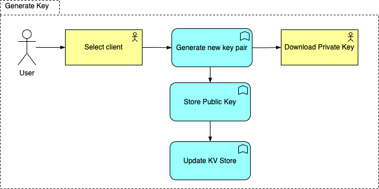
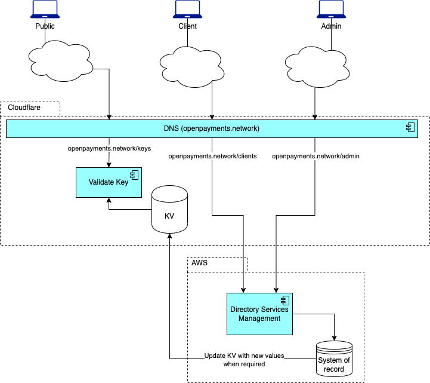

<!-- Output copied to clipboard! -->

<!-----

You have some errors, warnings, or alerts. If you are using reckless mode, turn it off to see inline alerts.
* ERRORs: 0
* WARNINGs: 0
* ALERTS: 25

Conversion time: 7.657 seconds.


Using this Markdown file:

1. Paste this output into your source file.
2. See the notes and action items below regarding this conversion run.
3. Check the rendered output (headings, lists, code blocks, tables) for proper
   formatting and use a linkchecker before you publish this page.

Conversion notes:

* Docs to Markdown version 1.0β33
* Wed Jun 22 2022 04:42:49 GMT-0700 (PDT)
* Source doc: Open Payments Network Directory
* Tables are currently converted to HTML tables.
* This document has images: check for >>>>>  gd2md-html alert:  inline image link in generated source and store images to your server. NOTE: Images in exported zip file from Google Docs may not appear in  the same order as they do in your doc. Please check the images!

----->


<p style="color: red; font-weight: bold">>>>>>  gd2md-html alert:  ERRORs: 0; WARNINGs: 0; ALERTS: 25.</p>
<ul style="color: red; font-weight: bold"><li>See top comment block for details on ERRORs and WARNINGs. <li>In the converted Markdown or HTML, search for inline alerts that start with >>>>>  gd2md-html alert:  for specific instances that need correction.</ul>

<p style="color: red; font-weight: bold">Links to alert messages:</p><a href="#gdcalert1">alert1</a>
<a href="#gdcalert2">alert2</a>
<a href="#gdcalert3">alert3</a>
<a href="#gdcalert4">alert4</a>
<a href="#gdcalert5">alert5</a>
<a href="#gdcalert6">alert6</a>
<a href="#gdcalert7">alert7</a>
<a href="#gdcalert8">alert8</a>
<a href="#gdcalert9">alert9</a>
<a href="#gdcalert10">alert10</a>
<a href="#gdcalert11">alert11</a>
<a href="#gdcalert12">alert12</a>
<a href="#gdcalert13">alert13</a>
<a href="#gdcalert14">alert14</a>
<a href="#gdcalert15">alert15</a>
<a href="#gdcalert16">alert16</a>
<a href="#gdcalert17">alert17</a>
<a href="#gdcalert18">alert18</a>
<a href="#gdcalert19">alert19</a>
<a href="#gdcalert20">alert20</a>
<a href="#gdcalert21">alert21</a>
<a href="#gdcalert22">alert22</a>
<a href="#gdcalert23">alert23</a>
<a href="#gdcalert24">alert24</a>
<a href="#gdcalert25">alert25</a>

<p style="color: red; font-weight: bold">>>>>> PLEASE check and correct alert issues and delete this message and the inline alerts.<hr></p>


# Open Payments Network Directory


## Bootstrapping the PKI for Open Payments

For Open Payments to work, clients, resource servers, and authorisation servers need to use keys to identify themselves.

To bootstrap the network these keys will be maintained in a directory at [https://openpayments.network](https://openpayments.network). In future, this may migrate to using a decentralized directory or an alternative system that supports dynamic registration.

Open Payments relies on the [Grant Negotiation and Authorisation Protocol (GNAP)](https://datatracker.ietf.org/doc/html/draft-ietf-gnap-core-protocol) for authorisation of operations between participants.

GNAP assumes that all client requests include a proof of ownership of a key that identifies the client making the request. 

Initially, Open Payments will only support the HTTP Message Signing proof and JSON Web Keys as keys. This may expand in future to include mTLS and client certificates.

The purpose of the Open Payments Network Directory is to provide a directory of verified clients and their keys that can be referenced by other participants.

## Process

Any client that wishes to be listed in the directory must provide evidence of its identity such as ownership of a domain name, email address or social media handle.

The client then generates one or more key pairs it wishes to use to sign requests. The directory associates each key with a unique key identifier (a URL) that can be used to identify the key during GNAP interactions.

When the client makes requests to an authorization server or resource server, the server MAY use the directory APIs to verify the identity of the client per [Section 2.3](https://datatracker.ietf.org/doc/html/draft-ietf-gnap-core-protocol#section-2.3) of the GNAP specification.

## Benefits

A registered client is lower risk than an anonymous client and any data such as the URL and display name of the client that are stored in the directory will be verified before being included.

This gives the server some confidence that the client is who they claim to be and will mitigate DDoS attacks from anonymous clients.

Servers will display client information to end users during interactions therefore it is essential that they can rely on the veracity of the information. It will be the responsibility of the Open Payments Network Directory operators to verify client information they receive and store in the directory.

Centralizing this function is an effective way to reduce costs while bootstrapping the network. Using URLs as key identifiers means that the functionality can be decentralised easily later.

## API Overview

**https://openpayments.network/directory/clients/{clientId}**

Used to create, edit, update and delete participant records in the registry.

**https://openpayments.network/directory/clients/{clientId}/keys**

Used to get the JSON Web Key Set for a client.

**https://openpayments.network/directory/keys/{keyName}**

Used to query the registry by key identifier. Returns the details of the client that has registered this key and the details of the key itself.

To allow for additional registries or PKI systems in future, all keys on the registry will use their canonical URL as a key identifier. 

Example:

```
https://openpayments.network/directory/keys/13cbb947-1076-4462-82e9-626c2a0e9def
```

## High Level User Journey

A client that wishes to join the network will sign up via [https://openpayments.network](https://openpayments.network).

They will need to provide, at a minimum, an email address, password and set up 2FA to protect their account.

The client should have a way to prove ownership of a domain or URL that identifies the client and any social media handles that would assist end-users to verify the client’s identity. In future this could link to existing identity systems such as GlobalID or leverage Verified Claims.

Once the client has verified their account they can request that a new key is generated for them. The directory will assign a new key id to each key. The private key is made available to the client to download once off. The private key is not stored by the registry. In future the client will be able to upload a public key and prove possession of the private key.

The client can then use this key to sign requests to any RS or AS on the network. 

The client will be able to login to their account and manage their keys, and public information. 

Key management will allow revoking a key or adding a new key.

Changes to the verified client information must be reverified. If an administrator considers the changes to be material then they will force all keys to be revoked and new keys to be issued for the client.

## Functional Design

The primary function of the system is to verify public keys against clients. A KV store will be used to optimize the lookups and maximise the throughput of this function.


## User Stories and User Journeys

Clients will shift between the Pending and Verified Stores as changes are made to client accounts.  Every client change will add a new, or update if existing, client record to the pending store awaiting manual verification.  Upon verification, client accounts will move to the verified store.


### Register Client User and Add Client

The user is required to register, verify the email address and set up 2FA.  Thereafter, the client account details need to be created and the account will be saved to the verified store awaiting verification.


### Edit Client

Client user to select one of the client’s he/she has permission to administer and amend/capture new details.  Client account set to pending until new changes have been verified.


### Close Client Account

Client user to select one of the client’s he/she has permission to administer and update client account to closure/deleted status.  The client account keys will be expired and removed from the KV Store, the client will emailed notifying them of the account closure


### Generate Key

Client user to select one of the client’s he/she has permission to administer and click to generate a key pair and then download the private key.  The system will store the public key and update the KV store.




### Revoke Key

Client user to select one of the client’s he/she has permission to administer and select the revoke action as well as the key.  System will remove the key from the system and the KV store.


### Admin Management

Admin users are able to assign and remove admin roles to and from system users.


#### 	Revoke Key

The Admin user can revoke client keys when required.  It follows the same journey as the client user, however, the admin user will have access to all clients.


#### Verify Client

Admin user to find all pending clients and manually set verification on the respective client accounts.  The system will move the verified client accounts from the pending store to the verified store.


#### Close Client Account

The Admin user can close client accounts when required.  It follows the same journey as the client user, however, the admin user will have access to all clients.


#### Assign Client User

The Admin user can assign additional system users to clients.


#### Remove Client User

The Admin user can remove system users from clients.


### Verify Client Key

The wallet journey is depicted below, whereby the client key sent to the API is verified against the KV store for the specific client.


## Proposed High Level Architecture

This is a proposed high level design based on current functional design and user journeys identified.



Cloudflare workers will be used to host the Validate Key API. The API will use the Cloudflare KV distributed key-value store to provide fast access to client key data. The KV store will be kept up to date by the Directory Services Management (DSM) module when clients are validated, or new keys are generated or revoked.

The DSM will be deployed to AWS Lambda (serverless) functions and will host both the client and administration systems. Requests to these systems will be routed to AWS endpoints by Cloudflare. The DSM will use a PostgreSQL RDS database instance as it’s system of record.

Logins to the DSM will be protected using 2FA using a Time-based One Time Password (TOTP) as provided by Google Authenticator or Microsoft’s Authenticator.

Edge technology is recommended to provide higher throughput and less latency.  This is accomplished by running computing processes as close to the source as possible, thereby allowing for maximum throughput and minimizing latency by not running unnecessary computing processes through the network.

## Physical Architecture


Cloudflare will be used to front the application and host the Validate Key API. The Worker KV store used by the Validate Key API will be kept up to date by the DSM. Web requests will flow through Cloudflare to API Gateway from where it will be dispatched to the correct Lambda function. The Lambda will be deployed outside of the VPC to allow multi-zone deployment and failover by AWS. The RDS instance will be deployed in a Private subnet in a VPC. An Elastic Network Interface will act as gateway between the Private Subnet and the public internet, allowing only the Lambda’s security group access.

Cloudflare workers offer:

* the ability to add custom logic whereby decisions can be made to cache requests at the edge. 
* Split one request into multiple parallel requests.
* Enhanced security by implementing custom security rules and filters with custom authentication and authorization mechanisms also possible.
* Increased reliability:
    * by responding dynamically when an origin server is unreachable
    * implement custom load balancing and failover
    * deploy fast fixes

## High Level Application Design

The model below describes the high-level application design, illustrating the component integration points and the component functions.


## Proposed High Level Data Design


### Table Descriptions

#### Pending Client

| Key    | Column Name            | Data Type         | Description                                                                               |
|--------|------------------------|-------------------|-------------------------------------------------------------------------------------------|
| PK     | ID                     | UUID              | Unique client Identifier                                                                   |
|        | Name                   | String            | Client Name                                                                               |
|        | LogoURL                | URL (String)      | URL to client Logo                                                                        |
|        | URL                    | URL (String)      | URL to client site                                                                        |
|        | Email                  | Email (String)    | Client email address                                                                      |
| FK     | TypeID                 | UID               | Client type ID associated to the client type name, e.g. ledger or account holder          |
| FK     | StatusID               | UID               | Client status ID associated to the status name of either: active, suspended or deleted    |
| FK     | SystemUserIDUpdated    | UID               | System user ID allowed to administer the account                                          |
|        | DateTimeUpdated        | DateTime          | Date and Time update was processed                                                        |

#### Verified Client

| Key    | Column Name    | Data Type         | Description                                                                               |
|--------|----------------|-------------------|-------------------------------------------------------------------------------------------|
| PK     | ID             | UUID              | Unique client Identifier                                                                   |
|        | Name           | String            | Client Name                                                                               |
|        | LogoURL        | URL (String)      | URL to client Logo                                                                        |
|        | URL            | URL (String)      | URL to client site                                                                        |
|        | Email          | Email (String)    | Client email address                                                                      |
| FK     | TypeID         | UID               | Client type ID associated to the client type name, e.g. ledger or account holder          |
| FK     | StatusID       | UID               | Client status ID associated to the status name of either: active, suspended or deleted    |


#### Status

| Key    | Column Name    | Data Type    | Description                                     |
|--------|----------------|--------------|-------------------------------------------------|
| PK     | ID             | UUID         | Unique status Identifier                         |
|        | StatusName     | String       | Status Name, e.g. Active, Suspended, Deleted    |


#### ClientType

| Key    | Column Name    | Data Type    | Description                               |
|--------|----------------|--------------|-------------------------------------------|
| PK     | ID             | UID          | Unique client type Identifier              |
|        | TypeName       | String       | Type Name, e.g. Ledger, Account Holder    |

#### Role

| Key    | Column Name    | Data Type    | Description                    |
|--------|----------------|--------------|--------------------------------|
| PK     | ID             | UID          | Unique role Identifier          |
|        | RoleName       | String       | Role Name, e.g. User, Admin    |

#### SystemUser

| Key    | Column Name    | Data Type         | Description                                                                               |
|--------|----------------|-------------------|-------------------------------------------------------------------------------------------|
| PK     | ID             | UUID              | Unique system user Identifier                                                              |
|        | Name           | String            | System User Name                                                                          |
|        | Email          | Email (String)    | System User email address                                                                 |
| FK     | RoleID         | UID               | RoleID associated to the assigned role                                                    |
| FK     | StatusID       | UID               | Client status ID associated to the status name of either: active, suspended or deleted    |

#### SystemUserClient

| Key       | Column Name     | Data Type    | Description                                                                               |
|-----------|-----------------|--------------|-------------------------------------------------------------------------------------------|
| PK, FK    | ClientID        | UUID         | Unique client Identifier                                                                   |
| PK, FK    | SystemUserID    | UUID         | Unique system user Identifier                                                              |
| FK        | StatusID        | UID          | Client status ID associated to the status name of either: active, suspended or deleted    |

#### Keys

| Key    | Column Name       | Data Type    | Description                                                                                        |
|--------|-------------------|--------------|----------------------------------------------------------------------------------------------------|
| PK     | ID                | UUID         | Unique key Identifier                                                                              |
| FK     | ClientID          | UID          | Client ID to which the key is assigned                                                             |
|        | KeyType           | String       | Type of Key, e.g. OKP                                                                              |
|        | KeyOps            | String       | Key Operations, e.g. sign, verify                                                                  |
|        | Algorithm         | String       | Key Algorithm, e.g. EdDSA                                                                          |
|        | Curve             | String       | Required… Must be set to Ed25519                                                                   |
|        | Public Key        | String       | Required, contain the encoded base64URL [RFC4648] key                                              |
|        | JWKSet            | String       | Full JWK Key made up of the KeyID, KeyType, KeyOps, Algorithm, Curve                               |
| FK     | StatusID          | UID          | Client status ID associated to the status name of either: active, suspended or deleted             |
|        | Expiry            | Bool         | Flag to indicate whether the key expires                                                           |
|        | ExpiryDateTime    | DateTime     | Date and time when key needs to expire                                                             |
|        | NBF               | Bool         | Flag to indicate whether the key should not be active until a certain date and time is reached.    |
|        | NBFDateTime       | DateTime     | Date and time when the key will become active                                                      |

### Schema - JWK Set

The registry will hold the following data for each participant.

| Property    | Type             | Description                                                    |
|-------------|------------------|----------------------------------------------------------------|
| id          | UUID             | A unique identifier for the client.                             |
| name        | String           | The public name of the client.                                 |
| image       | URL              | The URL of an image representing the client such as a logo.    |
| URL         | URL              | The public URL of the client.                                  |
| email       | Email Address    | The public email address of the client.                        |
| keys        | JWK Set          | A JSON Web Key Set as defined in RFC7517.                       |

In keeping with the general trend toward the use of EdDSA and to lower the implementation burden the keys in each JWK Set MUST adhere to the following restrictions, above and beyond those defined in RFC7517 and RFC8037.

* “kid” (Key ID) is a mandatory parameter. All key IDs in the Open Payments Network will be URLs with the host value of openpayments.network. A globally unique (unique across all participants) key name MUST be assigned by the registry and not be provided by the participant.
* “kty” (Key Type) MUST be “OKP”.
* “use” (Key Use) MUST be “sig” if specified.
* “key_ops” (Key Operations) MUST be “sign” and “verify” if specified.
* “alg” (Algorithm) MUST be “EdDSA”.
* “crv” (Curve) MUST be “Ed25519”.
* "x" (Public Key) MUST be present and contain the public key encoded using the base64url [[RFC4648](https://www.rfc-editor.org/rfc/rfc4648)] encoding.
* “d” (Private Key) MUST NOT be present.

In addition to these standard parameters, the registry will keep the following additional parameters for each key:

* “revoked” (Revoked) MUST be present and have the value of “true” if the key has been revoked.
* “exp” (Expiry) MUST be present if the key has a defined lifetime and is not usable after the given date and time. Follows the format and interpretation of the “exp” claim defined for JSON Web Tokens in [RFC7519](https://www.rfc-editor.org/rfc/rfc7519.html#section-4.1.4).
* “nbf” (Not Before) MUST be present if the key has a defined lifetime and is not usable before the date and time. Follows the format and interpretation of the “nbf” claim defined for JSON Web Tokens in [RFC7519](https://www.rfc-editor.org/rfc/rfc7519.html#section-4.1.4).

See the registries for more details and links to relevant RFCs:
[https://www.iana.org/assignments/jose/jose.xhtml](https://www.iana.org/assignments/jose/jose.xhtml#web-key-types)
[https://www.iana.org/assignments/jwt/jwt.xhtml](https://www.iana.org/assignments/jwt/jwt.xhtml)


## Client Registration and Amendment Journeys


A logged-in system user can register a client.  Upon registration, the client’s details are captured into a ‘PendingClient’ store awaiting verification with a status of ‘New’.  This verification process is completed by an Admin User and will trigger a system process whereby the client record in the ‘PendingClient’ store is inserted into the ‘VerifiedClient’ store with a status of ‘Active’ and the ‘PendingClient’ record status is set to ‘Complete’.

When a system user amend client details, the record in the ‘VerifiedClient’ store is set to ‘Pending’ while a new ‘PendingClient’ record is created with a status new.  The new ‘PendingClient’ record needs to be verified by an admin user to set the client account to active.


### Purpose and Reason for 2 Client Stores (Pending and Verified)

The pending client store receives all the new and/or amended client details.  This store therefore keeps a copy of the new/amended request before verification.  This store also acts as a history for all client details changes.

The verified client store will only keep one client record.  This will be the latest verified record.  

The purpose of these 2 client stores is to maintain history and/or version control, thus providing the ability to view when changes were requested and who requested the changes.


## Roles and Permissions


Currently only 2 roles have been identified, i.e. User/System User and Admin User

The system user has access to all functions within the User, Client, KeyManagement and 2FA/MFA modules.

The admin user has access to all functions within the Admin, KeyManagement, 2FA/MFA modules.

Public users will only have access to verify a client key against the directory and will not require any system user account to login. 

The system module is triggered by specific events.


### List of Modules

| #    | Function             | Description                                      | Modules    |
|------|----------------------|--------------------------------------------------|------------|
| 1    | UserSignUp           | Capture the users’ details                       | User       |
| 2    | VerifyUserDetails    | Verify user email and cell no.                   | User       |
| 3    | Setup 2FA/MFA        | Setup 2-Factor or Multi-Factor Authentication    | User       |


| #    | Function                          | Description                                                           | Modules    |
|------|-----------------------------------|-----------------------------------------------------------------------|------------|
| 1    | CaptureClientDetails              | Add Client Details to pending store                                   | Client     |
| 2    | GetClientsForUser                 | Get all clients assigned to the logged in user from verified store     | Client     |
| 3    | AmendClientDetails                | Update client details                                                 | Client     |
| 4    | CloseClientAccount                | Update client status and set account to deleted                       | Client     |
| 5    | SaveDetailsToPendingStore         | Save client details to the pending store                              | System     |
| 6    | DeleteClientAccountInAllStores    | Mark client account as deleted in all stores                          | System     |
| 7    | GetClientsFromAllStores           | Get clients from all stores                                           | System     |
| 8    | MoveClientToVerified               | Move client to verified store                                          | System     |


| #     | Function                          | Description                                                      | Modules    |
|-------|-----------------------------------|------------------------------------------------------------------|------------|
| 1     | VerifyClient                      | Set client account to verified                                    | Admin      |
| 2     | AmendUserRole                     | Amend the role of a system user                                  | Admin      |
| 3     | CloseClientAccount                | Update client status and set account to deleted                  | Admin      |
| 4     | GetUsers                          | Get all system users                                             | Admin      |
| 5     | GetClients                        | Get all clients (Admin user)                                     | Admin      |
| 6     | GetPendingClient                  | Get all clients from the pending store                           | Admin      |
| 7     | AssignClientUser                  | Assign system user to a client                                   | Admin      |
| 8     | RemoveClientUser                  | Remove system user from a client                                 | Admin      |
| 9     | MoveClientToVerifiedStore          | Move client account from pending store to verified store          | System     |
| 10    | UpdateUserRole                    | Update the system user role                                      | System     |
| 11    | DeleteClientAccountInAllStores    | Set client accounts to deleted in pending and verified stores     | System     |


| #    | Function                | Description                                   | Modules          |
|------|-------------------------|-----------------------------------------------|------------------|
| 1    | DeleteClientKey         | Delete a specific client key                  | KeyManagement    |
| 2    | GenerateKeyPair         | Generate new key pair for a client            | KeyManagement    |
| 3    | SavePublicKey           | Save client public key                        | KeyManagement    |
| 4    | DownloadPrivateKey      | Download client private key                   | KeyManagement    |
| 5    | RemoveKeyFromKVStore    | Delete client key from KV Store               | System           |
| 6    | UpdateKVStore           | Update KV Store with new key and client id    | System           |


